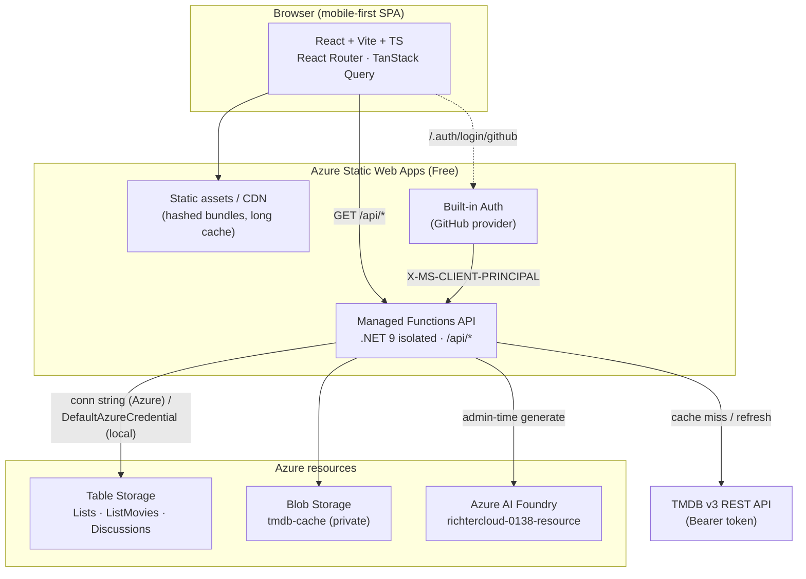
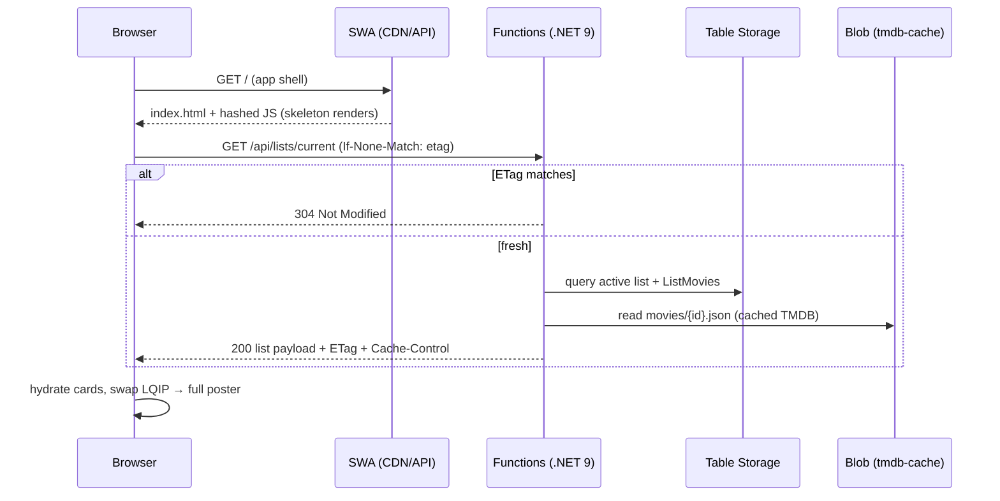
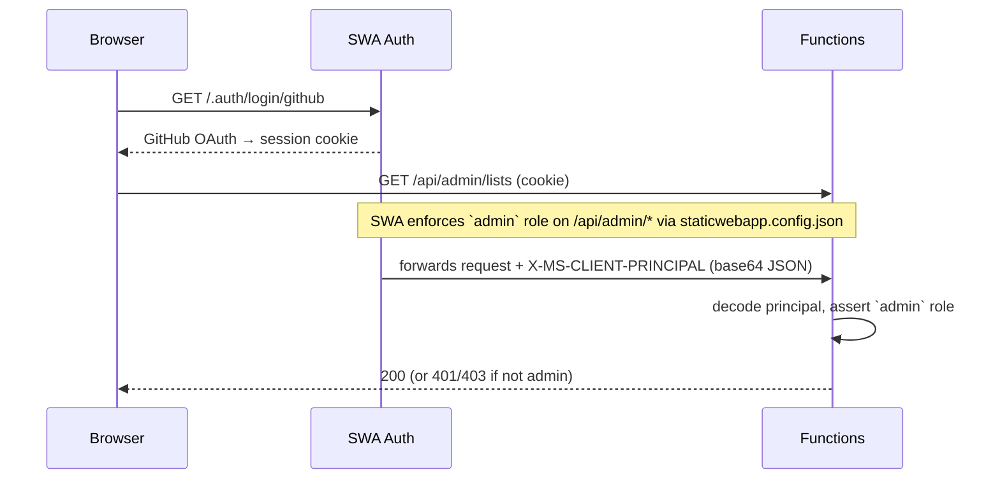
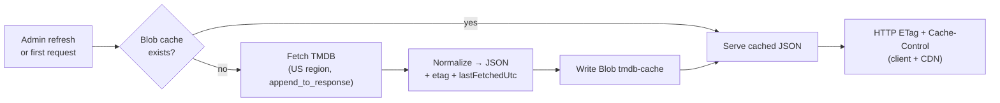
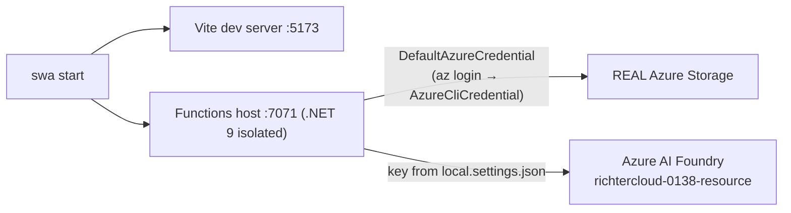

# Architecture

Family movie watchlist on Azure Static Web Apps (Free) with a managed **.NET 9 isolated** Functions API,
Azure Table + Blob Storage, TMDB integration, and Azure OpenAI for admin-time discussion-topic generation.

> See `PLAN.md` → **Resolved constraints** for why Managed Identity and .NET 10 were not used.

## Component diagram

## Request sequence — public list page

## Auth flow (admin)

## Caching strategy

- TMDB cache is **indefinite** (data changes rarely). Refresh is **manual** (per-movie or bulk).
- Bulk refresh is **chunked** to respect the **45 s** SWA API timeout and TMDB rate limits.
- The browser never calls TMDB or Storage directly — all access is server-side.

## Data model

### Table `Lists`
| Key/Field | Type | Notes |
| --- | --- | --- |
| PartitionKey | string | constant `"list"` |
| RowKey | string | `listId` (guid/slug) |
| title | string | e.g. "Summer 2026" |
| slug | string | URL slug |
| period | string | display period |
| isActive | bool | only one active at a time |
| sortOrder | int | |
| createdUtc | datetime | |

### Table `ListMovies`
| Key/Field | Type | Notes |
| --- | --- | --- |
| PartitionKey | string | `listId` |
| RowKey | string | `tmdbId` |
| order | int | card ordering |
| notes | string | curator notes |
| addedUtc | datetime | |

### Table `Discussions`
| Key/Field | Type | Notes |
| --- | --- | --- |
| PartitionKey | string | `tmdbId` |
| RowKey | string | constant `"current"` |
| topicsJson | string | serialized topic list |
| source | string | `ai` \| `manual` |
| status | string | `draft` \| `published` (public renders `published` only) |
| model | string | e.g. `gpt-4o-mini` |
| generatedUtc | datetime | |
| approvedBy | string | admin GitHub login |
| approvedUtc | datetime | |

### Blob `tmdb-cache` (private)
- `movies/{tmdbId}.json` — normalized TMDB payload. We capture **greedily**: title, original title,
  language, year, runtime, US certification + all US release dates, overview, tagline, status, homepage,
  imdb id, budget/revenue, popularity, vote avg/count, genres, keywords, spoken languages, production
  companies/countries, collection, full cast + crew (with ids, order, profiles), and US watch/providers —
  plus the **complete raw TMDB response** retained verbatim. Each payload carries `etag` + `lastFetchedUtc`.
  Fields are stored even when the app does not surface them yet, so new features need no re-fetch.
- `posters/{tmdbId}.jpg` — optional downloaded thumbnail for fast perceived load.

## Local development

No Azurite. Local Functions reach **real** Azure Storage via `DefaultAzureCredential`, which resolves your
`az login` (Azure CLI credential). TMDB and Azure AI Foundry (`richtercloud-0138-resource`) use tokens from
the gitignored `api/local.settings.json`.
